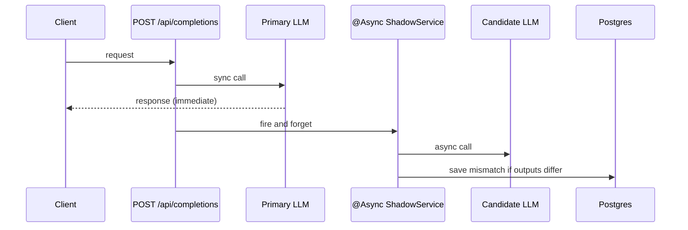

# LLM Proxy Server

Spring Boot proxy that routes customer traffic to a **primary** LLM synchronously, fires an **async shadow** request to a **candidate** model, logs mismatches to Postgres, and exposes real-time match metrics.

## Architecture



## API

| Endpoint | Method | Description |
|----------|--------|-------------|
| `/api/completions` | POST | `{ "prompt": "..." }` → primary response |
| `/metrics` | GET | Match rate counters |
| `/mock/primary` | POST | Embedded mock (when `MOCK_LLM_ENABLED=true`) |
| `/mock/candidate` | POST | Embedded mock (when enabled) |

## Local setup

**Requirements:** Java 21, Maven

```bash
cp .env.example .env
# edit .env with your values
./mvnw spring-boot:run
```

Test:

```bash
curl -X POST http://localhost:8080/api/completions \
  -H "Content-Type: application/json" \
  -d '{"prompt":"hello"}'

curl http://localhost:8080/metrics
```

## Configuration

All secrets via `.env` (see `.env.example`). Spring loads it automatically.

| Variable | Description |
|----------|-------------|
| `SPRING_PROFILES_ACTIVE` | `prod` for deployment |
| `DB_*` | DigitalOcean Postgres credentials |
| `PRIMARY_LLM_URL` / `CANDIDATE_LLM_URL` | Upstream LLM URLs |
| `MOCK_LLM_ENABLED` | `true` for local/demo embedded mocks |

## DigitalOcean deployment

### Droplet one-time setup

```bash
apt update && apt install -y docker.io
systemctl enable docker && systemctl start docker
mkdir -p /opt/llm-proxy
nano /opt/llm-proxy/.env   # copy from .env.example, fill real values
chmod 600 /opt/llm-proxy/.env
```

Add droplet IP to Postgres **Trusted sources** in DO Console.

### Container registry

Images push to: `registry.digitalocean.com/llm-proxy-server/llm-proxy`

### GitHub Actions secrets

| Secret | Value |
|--------|-------|
| `DOCR_TOKEN` | DigitalOcean API token |
| `DOCR_REGISTRY` | `llm-proxy-server` |
| `DROPLET_HOST` | Droplet public IP |
| `DROPLET_USER` | `root` |
| `DROPLET_PASSWORD` | Droplet password |

- **CI/CD** (`.github/workflows/pipeline.yml`): H2-based tests on every push/PR; build, push DOCR, and deploy on `main` only

## Tech stack

Java 21 · Spring Boot 4 · PostgreSQL · Flyway · JPA · RestClient · `@Async`
